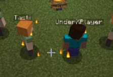

Een weerwolven in wakkerdam plugin

Zo veel mogelijk getest bij mezelf en het heeft een werkende gameplay

enigste bug die ik weet is dat de plugin niet altijd doorheeft dat het spel afgelopen is, je kan zelf een check activeren door `/ww test` uit te voeren

Commands:
De enigste commands die de kids hoeven te weten zijn:
- /ww join
  - dit is om een spel te joinen
- /ww leave
  - dit is om het spel te verlaten

Als game master (die het tempo van het spel beheert):
- /ww start
  - start een heel nieuw spel met de mensen die gejoined zijn
  
- /ww night
  - start de nacht
  
-/ww vote
  - start het stemmen die op het kampvuur gegooit wordt
  
-/ww end
  - stop het spel en zet alle spelers weer terug in de gamemode waar ze in waren
  
-/ww test
  - deze command staat niet in de auto completion, voor een stomme rede kan het gebeuren dat een “check” van wie er dood gaat en wie er gewonnen heeft niet af, met deze command kan je het geforceerd nog een keer doen

# /ww night
Wat gebeurd er hier, alle eerst wordt alle spelers onzichtbaar gemaakt behalve voor de gamemaster en voor de weerwolven, de weerwolven zien iedereen en kunnen ook bewegen, zij moeten bij een speler staan om die vervolgens op te eten, na (standaard 30) secondes word de speler met de meeste wolven gemarkeerd als “opgegeten”

Tastii en UnderXPlayer staat dicht bij speler Dev_5, deze speler is geselecteerd

Een wolf staat letterlijk achter speler Dev_9, op het scherm net boven de hotbar staat er ook dat deze speler geselecteerd is.

Tijdens de wolven activiteit krijgt de ziener een inventory/scherm te zien met gezichten, hieruit kan de speler een andere speler kiezen en zien wat zijn of haar role is, de role wordt express niet in de chat geschreven omdat de ziener het zelf moet onthouden

Na de wolven wordt de heks actief, de heks krijgt de keuze om de opgegeten speler te genezen of niet, na deze keuze kan de heks kiezen of ze iemand gaat vermoorden, mocht ze iemand gaan vermoorden dan mag ze ook iemand kiezen met de zelfde style als de wolven (iedereen onzichtbaar voor iedereen behalve de heks) en moet ook bij iemand staan om te vergiftigen. Alle heal en vermoord acties kunnen een keer uitgevoerd worden want de heks heeft maar 2 flesjes (1 met geneeskrachtige powers en een dodelijke)

De keuze scherm voor de heks: “Dev_5 was vermoord, wilt u hem weer tot leven brengen” rood: nee, groen: ja

# /ww vote
Na de nacht moet er natuurlijk iemand het vuur op gegooid worden, deze command heeft maximaal 1 minuut wacht tijd en kan eerder klaar zijn als iedereen gestemt heeft, met deze commando krijgt iedereen een scherm met spelers hoofden (skulls als ze dood zijn) waar ze op kunne stemmen, iedereen kan zien wie op wie gestemt heeft, de doden krijgen ook dit scherm maar kunnen niet stemmen. Nadat iedereen gestemt heeft wordt de speler met de meeste stemmen op het vuur gegooid. NOTE: soms kan het zijn dat je “/ww test” moet doen om de doden omroep te laten starten

Dit is het scherm wat iedereen te zien krijgt, hier is iedereen nog in levend. (als een speler dood is dan wordt het hoofd vervangen door een skull)

Particle effects:
Er zijn verschillende effecten in werking, al deze effecten zijn zichtbaar voor de gamemaster en voor de betreffende role!

In deze screenshot zien je dat Dev_5 en Dev_6 hartjes hebben, deze 2 zijn een koppel en zien elkaar met hartjes om zich heen, alleen deze 2 en cupido zien de hartjes!

Tastii en UnderXPlayer hebben vuur particles, dit zijn de weerwolven, alleen de weerwolven kunnen elkaar zo herkennen.

Een Heks heeft paarse “tover” sprankels omhoog gaan bij de speler
[geen screenshot]

Een ziener heeft witte wolken bij de voeten, voor een mystic gevoel
[geen screenshot]